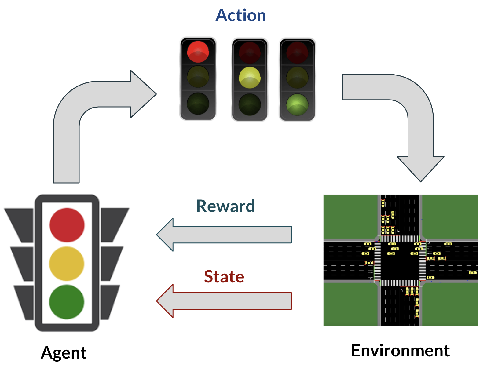
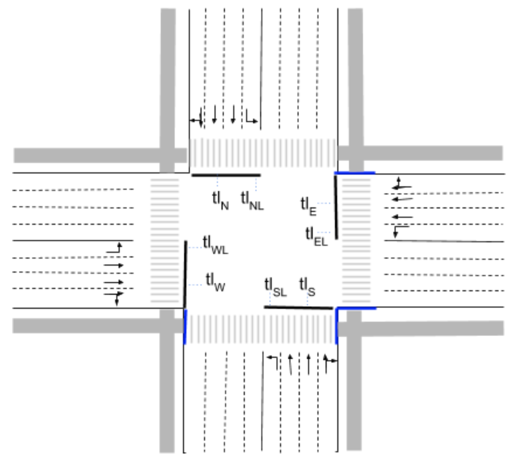
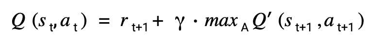
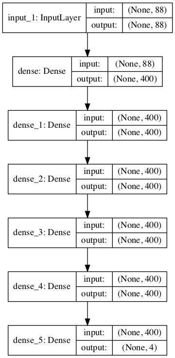

Reinforcement learning is about taking suitable action to maximize reward in a particular situation. While researching the possible applications of such technique, I came across such examples as resource management (learn to allocate and schedule computer resources to waiting jobs, with the objective to minimize the average job slowdown), optimizing chemical reactions (in order to reduce time-consuming and trial-and-error work in a relatively stable environment), etc. However, the idea that resonated with me the most, was creating an intelligent traffic light control system in order to regulate the situation around it, based on the current state.

Modern society relies heavily on vehicles to get around and the amount of traffic steadily increases over the last decades, however, our infrastructure is struggling to keep up. It is very common for a vehicle to arrive at an intersection and just stand there, waiting to pass, with no other traffic around. Such mismanagement gets amplified even more during the rush hour. Two solutions are possible in order to address this issue:

- Expand the roads to handle the traffic flow (this, however, is time consuming and requires a lot of funds, limiting the throughput during construction)
- Improve the traffic signal controllers (a more desirable approach, because it reuses the current equipment and has lower cost)

There were other attempts to solve this problem using deep reinforcement learning. In fact, I am using this [source](https://github.com/AndreaVidali/Deep-QLearning-Agent-for-Traffic-Signal-Control) code in order to help me achieve my goal. However, the urban environment cited above, does not contain pedestrians, an important part of any traffic scenario, therefore, the goal of my project is to augment the environment to add pedestrians and train the agent to react based on the amount of vehicles and pedestrians at the intersection.

The environment is represented by a 4-way intersection, where 4 lanes per arm approach the intersection from compass directions and lead to 4 lanes per arm leaving the intersection. The traffic light control system (TLCS) is represented by a single agent (a deep Q-learning neural network) that interacts with the environment using a state s, 
an action a, and a reward r.

During the simulation the agent samples the environment and receives a state st and a reward rt, where t is the current timestamp. According to the state st and the prior knowledge, the agent chooses the next action at. 

There are 8 different traffic lights in the environment, each of them regulating one or more adjacent lanes. The subscript denotes the position of every traffic light: for example, tlN regulates all traffic coming from north and wants to turn right or go straight; tlNL regulates traffic coming from north, but just for vehicles that want to turn left. Pedestrian traffic lights (there are two: going north to south, south to north and west to east and east to west) get turned on at the same time as the light for vehicles in the same direction. 

1000 vehicles and 240 pedestrians were generated according to Weibull distribution in order to simulate different traffic scenarios over 100 epochs. Every training episode starts out slow to simulate low load, the amount of traffic gradually increases as the episode progresses until it reaches its peak (equivalent to a rush hour) and gradually slows down. 75% of the traffic goes straight, the rest turns either left or right.

The traffic light phase is chosen based on 4 predetermined phases:
- green for lanes in the north and south arm dedicated to turn right or go straight, includes pedestrian light;
- green for lanes in the north and south arm dedicated to turn left;
- green for lanes in the east and west arm dedicated to turn right or go straight, includes pedestrian light;
- green for lanes in the east and west arm dedicated to turn left.

If the action chosen at a certain timestamp is different from the action taken previously, a 4 second yellow phase is initiated between the two actions, otherwise if the action is equivalent to the previous one, there is no yellow phase and the current state persists.
In reinforcement learning, the reward represents the feedback from the environment after the agent had chosen the action. The agent uses the reward to understand the result of the current action and improve the model for further action choices. In this case the reward is calculated based on the decrease of the cumulative waiting time after the action taken. 

The learning mechanism in this project is called Deep Q-Learning, which is a combination of deep neural networks and Q-Learning. Q-Learning is a form of model-free reinforcement learning, it consists of assigning a value (Q-value) to an action taken from a precise state of the environment. Here is the formula to calculate the Q-value after every action taken:

where Q(st,at) is the value of the action at taken from state st. The reward  rt+1 is the reward received after taking the action at in state st.The term Q'(st+1,at+1)is the Q-value associated with action at+1 in the state after  taking the action at in state st. The discount factor denotes a small penalization of the future reward compared to the previous reward. This way the agent can choose action at not just based on the immediate reward, but also on the expected future discounted rewards.

A deep neural network is built using Tensorflow 2.0 and Keras in order to map a state of the environment st to Q-values representing the values associated with actions at. The input state consists of 88 neurons, there are 5 hidden layers of 400 neurons each. The output layer consists of 4 neurons, representing the 4 possible actions.

As a result of the training, the queue length is gradually going down until it reaches 1-2 vehicles/pedestrians on average. The agent received a negative reward based on the cumulative waiting time change after the actions taken. 

Before Training            |  After training
:-------------------------:|:-------------------------:
|  

#### GETTING STARTED:

The following steps are necessary in order to be able to run the project:
1. Download and install Anaconda 
2. Download and install SUMO ([official site](http://sumo.sourceforge.net/))
3. Install tensorflow 2.0

#### RUNNING THE ALGORITHM:
Once the environment is set up, the directory needs to be changed to the directory containing all the files related to the project. In order to run the algorithm python training_main.py  command needs to be run on the Anaconda prompt or any other terminal and the agent will start training.

It is not necessary to open any SUMO software, everything is loaded and running in the background. There is an option to have a gui interface for every training episode, in order to do that, the gui parameter in training_settings.ini needs to be set to TRUE. This, however, will result in slower training, because the user has to press the start button every time for the training simulation to start.

#### CONTENTS:

* intersection - all the files needed to run the simulation in sumo-gui
* ped_environment.net.xml - file created in NetEdit (editing software for SUMO) in order to create all the edges if the environment
* ped_episode_routes5.rou.xml - file created using generator.py to generate traffic according to Weibull distribution and specify the route of every vehicle/pedestrian
* ped_sumo_config - configuration file to run the created environment in SUMO, connection between the environment file and the routes file.
* models - includes the model result after running the simulation
* model_2 - training results, includes charts depicting changes in the delay, queue length and cumulative rewards, as well as txt files with numbers that correspond to the points on the charts. Also contains the image of the model structure.
- test - test simulation results. 
* generator.py - a file to generate traffic according to Weibull distribution. 1000 cars and 240 pedestrians were generated. 75% of the traffic goes straight, the rest turns right or left.
* memory.py - handles the memorization for the experience replay mechanism. A function is used to add a sample into the memory, while another function retrieves a batch of samples from the memory.
* model.py - contains models used for training and testing episodes
* testing_main.py - handles the testing loop that starts the testing episode. Saves queue and reward graphs
* testing_settings.ini - settings to define such parameters as the input state, traffic amount, etc.
* testing_simulation.py - responsible for getting state of the environment, setting the next green phase or preprocess the data to train the neural network during testing.
* training_main.py - handles the main loop that starts an episode on every iteration. At the end it saves the network and it also saves 3 graphs: negative reward, cumulative wait time and average queues.
* training_settings.ini - settings to define such parameters as the input state, traffic amount, etc.
* training_simulation.py - responsible for getting state of the environment, setting the next green phase or preprocess the data to train the neural network during training.
* utils.py - automatically handles the creation of a new model version or loads the existing model for testing.
* visualization.py - used for plotting data

#### SETTINGS:
The settings used during the training and contained in the file training_settings.ini are the following:
* gui: enable or disable the SUMO interface during the simulation.
* total_episodes: the number of episodes that are going to be run.
* max_steps: the duration of each episode, with 1 step = 1 second (default duration in SUMO).
* n_cars_generated: the number of cars that are generated during a single episode.
* green_duration: the duration in seconds of each green phase.
* yellow_duration: the duration in seconds of each yellow phase.
* num_layers: the number of hidden layers in the neural network.
* width_layers: the number of neurons per layer in the neural network.
* batch_size: the number of samples retrieved from the memory for each training iteration.
* training_epochs: the number of training iterations executed at the end of each episode.
* learning_rate: the learning rate defined for the neural network.
* memory_size_min: the min number of samples needed into the memory to enable the training of the neural network.
* memory_size_max: the max number of samples that the memory can contain.
* num_states: the size of the state of the env from the agent perspective (a change here requires also algorithm changes).
* num_actions: the number of possible actions (a change here requires also algorithm changes).
* gamma: the gamma parameter of the bellman equation.
* models_path_name: the name of the folder that will contains the model versions and so the results. Useful to change when you want to group up some models specifying a recognizable name.
* sumocfg_file_name: the name of the .sumocfg file inside the intersection folder.
The settings used during the testing and contained in the file testing_settings.ini are the following (some of them have to be the same of the ones used in the relative training):
* gui: enable or disable the SUMO interface during the simulation.
* max_steps: the duration of the episode, with 1 step = 1 second (default duration in SUMO).
* n_cars_generated: the number of cars generated during the test episode.
* episode_seed: the random seed used for car generation, that should be a seed not used during training.
* green_duration: the duration in seconds of each green phase.
* yellow_duration: the duration in seconds of each yellow phase.
* num_states: the size of the state of the env from the agent perspective (same as training).
* num_actions: the number of possible actions (same as training).
* models_path_name: The name of the folder where to search for the specified model version to load.
* sumocfg_file_name: the name of the .sumocfg file inside the intersection folder.
* model_to_test: the version of the model to load for the test.

*The last section (SETTINGS) has been copied from the readme file [here](https://github.com/AndreaVidali/Deep-QLearning-Agent-for-Traffic-Signal-Control). The original creator outlined the settings perfectly, and could not have written it better.

A video of me presenting the results of the project can be found [here](https://www.loom.com/share/2b6dada4d69842b1a3b3606dde4f0ce9).